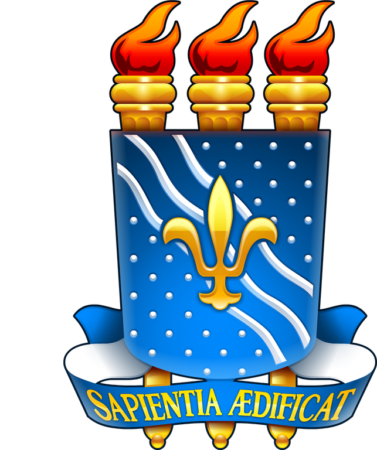

## Hello, Again!

This is my professional account! It's for my work at the Federal University of Paraíba.

<a href="https://rtomazini42.github.io/">
  <code></code>
</a>

### If you need, you can find me at:

<a href="https://rtomazini42.github.io/">
  <code></code>
</a>

<a href="mailto:renantomazini@sti.ufpb.br">
  <code></code>
</a>

<a href="https://maps.app.goo.gl/sRqmCoBxpi29D2tP7">
  <code></code>
</a>

### The technologies I’m working with here, in addition to offering support, include:

